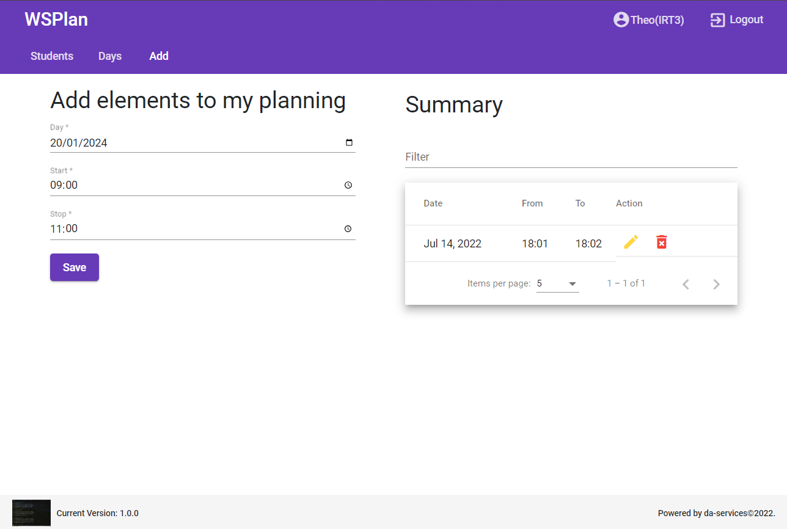

# WSPlan

WSPlan is a robust planning tool designed to streamline the scheduling process for educational environments. Leveraging AngularJS and @angular/material, WSPlan offers an intuitive, user-friendly interface that allows for efficient management of student work schedules.



## Key Features

- **User Authentication**: Users can log in with personalized credentials, as indicated by the user identification in the top right corner (Theo from IRT3).
- **Main Navigation**: Utilize the navigation bar to access "Students", "Days", and "Add" views for comprehensive planning management.
- **Work Schedule Management**: In the "Add elements to my planning" section, define work periods by selecting a day and specifying start and stop times.
- **Summary View**: A summary panel provides a snapshot of planned schedules, with functionalities to edit or delete entries as needed.
- **Filtering and Pagination**: Efficiently navigate through entries with filtering options and pagination controls.

## Getting Started

### Prerequisites

Before you begin, ensure you have removed the line `"baseHref": "https://github.com/yoan-theophile/wsplanFrontend"` from the `angular.json` file to run the application locally. Additionally, the backend server must be started with the following command:

```sh
json-server -w -H localhost -p 3000 db.json
```

### Login Credentials

Use the following credentials to log in to the application:

- Email: <tagne@tagne.com>
- Password: <tagne@tagne.com>

### User Information

To view users and their passwords, navigate to `http://localhost:3000/students`.

## Development Server

Run `ng serve` for a dev server. Navigate to `http://localhost:4200/`. The application will automatically reload if you change any of the source files.

## Code Scaffolding

Run `ng generate component component-name` to generate a new component. You can also use `ng generate directive|pipe|service|class|guard|interface|enum|module`.

## Build

Run `ng build` to build the project. The build artifacts will be stored in the `dist/` directory.

## Further Help

To get more help on the Angular CLI use `ng help` or go check out the [Angular CLI Overview and Command Reference](https://angular.io/cli) page.
